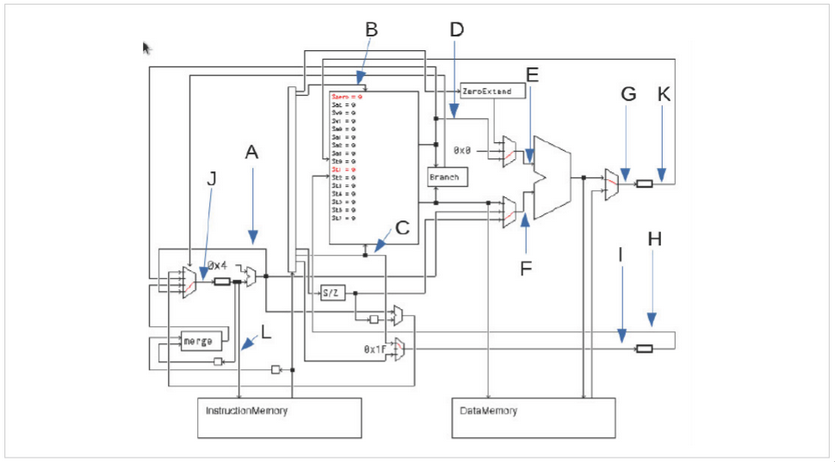

# Virtual Memory and Cache

### Disclaimer
Det här systemet är inte perfekt,
jag vet inte om all logik stämmer till 100%, men det
här är hur jag tänkte på uppgiften och det fungerade för mig.
Om man klarar den här uppgiften så behöver man bara skrapa ihop
15 poäng till för att klara tentan. 
Denna metod garanterar de flesta poängen på uppgiften iallafall

**Skicka feedback och frågor till mig om något är oklart eller fel.**

## Översikt

Så det här är alla tal som kan ändras i Uppgiften, 
utifrån dem går allt annat att räkna ut om man vet hur, 
jag tänker gå igenom alla tal och hur de hänger ihop.

## Page size

Vi tittar först på de första tre talen. 
Alla dessa påverkas endast av virtuellt-, fysiskt minne och page size (blå, grön och magenta).

Eftersom våran mips är 32 bits så är virtuellt minne 32 bitar, 
alltid, denna kommer aldrig ändras.

Fysiskt minne däremot ändras beroende på hur mycket RAM vi har, 
i detta fall har vi 4GB RAM vilket är 2^32 bytes.*\
Detta innebär då att även våran fysiska adress är 32 bitar stor; 
alltså exponenten i 2^32 är 32.

Det sista talet är page size, detta är 4kB vilket är 2^12 bytes.*
Här betyder exponenten i 2^12 att page offset är 12 bitar stor.

Vi kan nu fylla i de första tre talen i bilden.
Notera att vi har lite tur att både virtuellt och fysiskt minne är 32 bitar
vilket ger oss samma page number för båda.
Detta är definitivt inte alltid fallet.
* Offset = 12 bitar
* Virtual page number = virtuell adress - page offset = 32 - 12 = 20 bitar
* Physical page number = fysisk adress - page offset = 32 - 12 = 20 bitar

\* Bra att memorera att 2^32 = 4GB och 2^12 = 4kB, 
då är det lätt att ta reda på dessa om de ändras i uppgiften,
ex 2^33 = 8GB, 2^31 = 2GB och 2^13 = 8kB, 2^11 = 2kB.

## Tags
De nästa tre talen är relativt straight forward,
de påverkas endast av lines (röd) och den virtuell 
page vi räknade ut tidigare.

Först får vi reda på hur många lines vi har vilket innebär att vi har
så många lines som behöver jämföras. 
Därav är antalet lines = antalet Comparisons.
Så det hämtar vi bara från frågan vilket är 16 i detta fall.

Det andra numret kan vi som tur är också bara hämta.
Bredden av en line kommer direkt från bredden av virtual page number.
Den har vi redan räknat ut till 20 bitar, det viktiga är att vi kommer ihåg
att det är *virtual* page number och inte *physical* page number.

Det sista numret är nu lätt att räkna ut. Det är helt enkelt bara
_comparators_ * _lines_. I detta fall är det 16 x 20 = 320 bitar.

Vi kan nu fylla i de tre talen i frågan.
* Comparators = lines = 16
* Line width = virtual page number = 20 bitar
* Tag width = comparators * line width = 16 * 20 = 320 bitar

## Lines

Bland nästkommande 3 tal går 2 tal att skriva in direkt.
Ett av dem kräver dock lite mer beräkning, men påverkas endast av
data cache (gul) och data words (cyan).

Vi börjar att skriva in de enkla talen.
Dessa är physical adress och adress bits.

Physical adress är samma som när vi bestämde 
fysiskt minne i första delen.
Det är alltså 32 bitar, eftersom 4GB = 2^32 bytes.

Adress bits är _alltid_ 4..0.
Det är bara att komma ihåg.

Det andra talet är lite mer komplicerat.
För att ta reda på det måste vi först göra några beräkningar.

Vi börjar med att räkna ut hur mycket data vi har i varje line.
Detta räknas ut genom att multiplicera data words 
med bredden av en data word, rätt så logiskt.

data words * data word width = cache data line.\
I detta fall är det 8 * 4 = 32 bitar.

Nu delar vi bara hur mycket minne vi har i cache
med hur mycket data vi har i varje line. Minnet vi har anges
i KB så kom ihåg att tolka det som tusental.

cache size / cache data line = lines.\
I detta fall är det 64000 / 32 = 2000 lines.
I uppgiften frågas om antal lines i tusental, så svaret blir 2.

Vi kan nu fylla i de tre talen i frågan.
* Physical address = fysiskt minne = 32 bitar
* Address bits = 4..0
* Lines = cache size / cache data line = 64000 / 32 = 2000 lines = 2k lines
  * (Cache data line = data words * data word width = 8 * 4 = 32 bitar)

## Direct Mapped & Set Associative Cache

Den här delen av uppgiften är honestly rätt flummig. 
Det finns system för att räkna ut allt men jag föredrar och rekommenderar
att bara memorera vad det kan vara och utgå från det istället. 
Jag kan också alldeles för lite om hur man systematiskt räknar ut det.
Så det får bli memorering vilket fungerade för mig, 
men denna del av uppgiften är definitivt den svåraste.

### Direct Mapped Cache

Jag tycker vi börjar med de lättaste talen.

Antalet comparators verkar alltid vara 1 och bredden av en comparator verkar 
alltid vara 16 bitar.

Från detta kan vi nu räkna ut resten.
Kom ihåg hur stor vår fysiska adress är som vi räknade ut förut, 
2^x, i detta fall 2^32 = 32 bitar.
Eftersom bitar är nollindexerade så är det 31..0 vi följer.
Då är det första talet 31..16 eftersom vi har 16 bitar i en comparator.
Sedan, eftersom vi redan konstaterat att line offset är 5 bitar, 4..0.
Så vet vi att det sista talet är 15..5.

Nu är det endast storleken på vårat memory kvar.
För att räkna ut detta måste vi kika tillbaka på hur många lines vi har.
Från förra delen av uppgiften vet vi att vi har 2k lines:

Vi vet nu också att bredden av en comparator alltid är 16 bitar.
Så vi multiplicerar bara dessa två tal för att få storleken på vårat minne.
2k * 16 = 32k bitar minne.

Nu kan vi fylla i alla tal.
* Adress bits
  * 31..16 (16 bitar lång, alltid)
  * 15..5 (resten av adressen)
  * 4..0 (5 bitar lång, alltid)
* Cache memory = lines * comparator width = 2k * 16 = 32k bitar
* Comparators = 1
* Comparator width = 16 bitar

### Set Associative Cache

Här är det lite mindre tal att hålla reda på, och det är bara
ett av talen vi behöver ens räkna ut, resten är bara att memorera.

Vår fysiska adress är fortfarande 32 bitar, 2^32 = 4GB.
Därmed, eftersom bitar är nollindexerade, är det fortfarande 31..0 vi följer.

Första talet är därför 31.

Resterande tal är bara att komma ihåg. 13, 12 och 5.
Varför? Jo på set associative cache är det alltid x..13 för första intervallen.
Därmed, eftersom line offset alltid är 5 bitar, 4..0, så måste det sista talet alltid vara 12.
Så dessa kommer som jag förstått det, alltid vara samma. 
Det enda som ändras är den högsta biten som beroende på hur stor fysisk adressen är.

Vi kan nu fylla i alla tal.
* Adress bits
  * 31
  * 13
  * 12
  * 5

# MIPS Single Cycle Execution

## Översikt

Uppgiften lyder som följande:

Assume the program, MIps Code (Single Cycle) and the Mips Code View (with the expanded pseudo instructions),
has reached the "addiu rt rs expr" / "sb rt addr" / (något liknande) the first time (PC register = **0x0000001X**).
Fill out the below table.

32 bit signals should be given in hex (e.g. 0x12345678), while 5 bit signals should be given in binary form (e.g. 01010b).

## Steg 0: Vilken instruktion används

| Instruction       | Class      |
|-------------------|------------|
| add, sub, and, or | R-type ALU |
| addi, addiu, slti | I-type ALU |
| lw                | Load       |
| sw, sb            | Store      |
| beq, bne          | Branch     |
| j, jal            | Jump       |

Oftast är det addi eller addiu, har även sätt sb.

## A
I single cycle MIPS så ökar alltid PC med 4, så om `PC = 0x00000014` så blir 
`A = PC+4 = 0x00000014+4 = 0x00000018`
## B
Kolla på vilket register som används för **rs**, du bör kunna tabellen nedan.
| Register | Number | Binary |
|----------|--------|--------|
| $t0      | 8      | 01000  |
| $t1      | 9      | 01001  |
| $t2      | 10     | 01010  |
| $t3      | 11     | 01011  |
| $s0      | 16     | 10000  |

Svaret är alltid det binära värdet,
exempel:
sb $t3, 0($t1) -> register $t1 -> B = 01001b
addiu $t3, $t3, -32 -> register $t3 -> B = 01011b

## C
Kolla på vilket register som används för **rt**, sen är det alltid det binära värdet enligt tabellen.
Exempel:
sb $t3, 0($t1) -> register $t3 -> B = 01011b
addiu $t3, $t3, -32 -> register $t3 -> B = 01011b

## D
idk

## E
ALU second input. E = D.

## F
Med största sannolikhet 0x00000000

## G
sb - unused
addiu - idk

## H
sb - H = C
addiu - unused

## I
reversed H, so:
sb - not used
addiu - H=C

## J
sb - J=H=C
addiu - J=A

## K
sb - pray
addiu - not used

## L
Same as PC

## Key takeaways
Basically 2 catagories:
* sb
  * A = 4+PC
  * Kom ihåg register, alltid andra
  * Kom ihåg register, alltid första, C=H=J
  * D=E=?, K=?
  * F = 0x0000000
  * G, I unused
  * L = PC
* addiu
  * A=4+PC
  * Kommer antagligen bli B=I=C
  * D,E,F,G ingen aning
  * H & K not used
  * L = PC

# Instruction Encoding
Så som exempel: `addiu $t3, $t3, -32`

addiu är en I-type instruktion med 32 bits totalt:

---------------------------------------
| op (6) | rs (5) | rt (5) | imm (16) |
---------------------------------------

Så vi vet att för op måste vi fylla i 6 bits, för rs 5 bits o.s.v.
Enligt följande tabell (som man bör plugga in):
| Register | Number | Binary |
|----------|--------|--------|
| $t0      | 8      | 01000  |
| $t1      | 9      | 01001  |
| $t2      | 10     | 01010  |
| $t3      | 11     | 01011  |
| $s0      | 16     | 10000  |

Svaret för op = 001001b, svaret står på MIPS green card (opcode)
Svaret för rs = 01001b eftersom $t3 = 01011 (kom ihåg att svara rätt antal bits)
Svaret för rt = 01001b eftersom $t3 = 01011 (kom ihåg att svara rätt antal bits)

Så hitils är det lätt,
`addiu $t3, $t3, -32` översatt blir `op rt, rs, imm`
För imm måste man encoda -32 som en 16-bit 2's komplement nummer.

* Skriv ut imm i en 16-bitars binary:
  - 32 = 0000000000100000
* Invertera:
  - 0000000000100000 => 1111111111011111
* Lägg till 1 (2's kompliment)
  - Binary addition:
  -  1111111111011111
  - +               1
  - -----------------
  -  1111111111100000
Så i det här fallet är svaret för imm = 1111111111100000b = 0xFFE0
Om det istället skulle vara `addiu $t3, $t3, 32`, altså att imm är posetivt, skulle svaret bara vara
32 utskrivet binärt, så `0000000000100000`.

# MAX Frequency
Gratis uppgift.
Du får något i stil med:

"The clockperiod is determined by the slowest pipeline stage since;
All stages must complete within one clock cycle and the clock must 
be slow enough for the longest stage."

Så i det här fallet är det långsammaste 20ns:

*T_clock* = max(stage delays)
*f_max* = 1 / *T_clock* = 1 / (20 * 10⁽⁻⁹⁾) = 50 * 10⁶ Hz = 50 MHz

